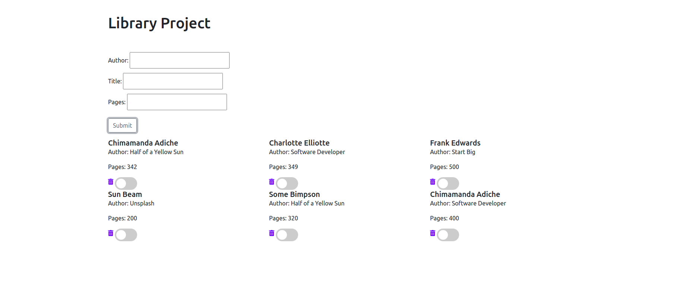

# Book Library 

Building a book library using HTML and Javascript

## Built With

- HTML
- Bootstrap
- JavaScript

## Getting Started

To get a local copy up and running follow these simple example steps.

- Clone the repository on your local machine
- cd into the folder

## Authors

👤 **Adeyemi Abiola Doyinsola**

- Github: [@Abidoyinsola1](https://github.com/Abidoyinsola1)
- Twitter: [@Abidoyinsola](https://twitter.com/abidoyinsola)
- LinkedIn: [Doyinsola Abiola Adeyemi](https://www.linkedin.com/in/doyinsola-adeyemi)

👤 **Rick Oburu**

- Github: [@RICKCOYL](https://github.com/RICKCOYL)
- Twitter: [@rickcoyl](https://twitter.com/Rickcoyl)
- Linkedin: [rick-oburu](https://www.linkedin.com/in/rick-oburu-8627591a4/)

## 🤝 Contributing

Contributions, issues and feature requests are welcome!

## Show your support

Give a ⭐️ if you like this project!